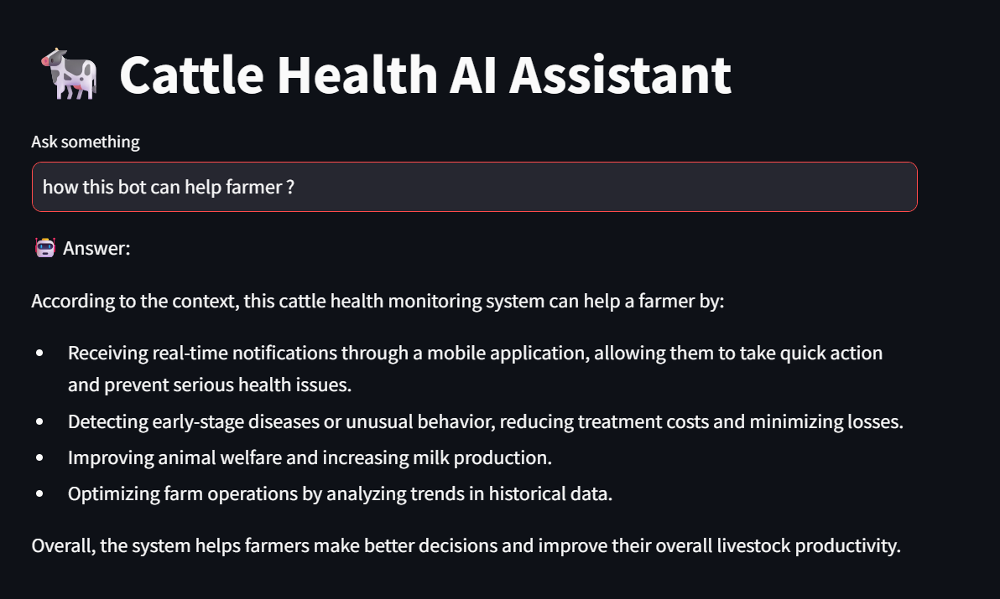
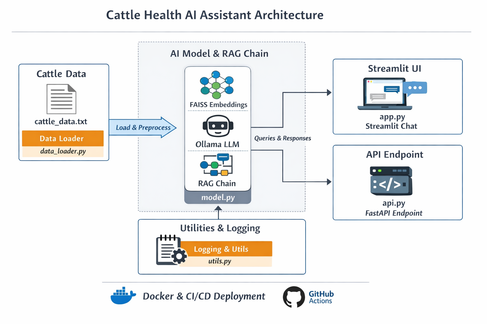

# Cattle Health AI



## Description

A multi-agent AI assistant for cattle health using **LangChain RAG**, **Ollama**, and **FAISS embeddings**.  

Supports:
- Nutrition advice  
- Disease diagnosis  
- Treatment recommendations  

Provides:
- Streamlit interface for interactive chat  
- FastAPI endpoint for integration  
- Logging of all queries

  cattle_ai_assistant/
├── data.txt
├── app.py          # Streamlit app
├── agent.py        # Multi-agent / tools
├── api.py          # FastAPI endpoints
├── requirements.txt
├── README.md
└── utils.py        # helper functions (optional)

## 🚀 How to Run

### 1. Clone the repo
```bash
git clone https://github.com/your-username/cattle_health_ai.git
cd cattle_health_ai
